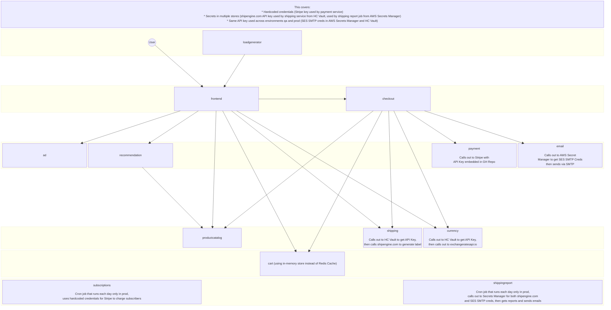

# Archodex Environment Setup

## Workload Overview


## Requirements
* A Kubernetes Cluster
* skaffold local installation
* helm local installation

## Steps
Run the following steps from the root directory of this repo

1. Setup namespaces: `kubectl apply -f archodex-env/manifests/`

1. Install Hashicorp Vault:
    1. Create certificate:
        1. Create temp directory: `mkdir -p cert`
        1. Generate private key: `openssl genrsa -out cert/vault.key 2048`
        1. Generate CSR: `openssl req -new -key cert/vault.key -out cert/vault.csr -config archodex-env/vault-csr.conf`
        1. Define Kubernetes CSR:
            ```sh
            $ cat > cert/csr.yaml <<EOF
            apiVersion: certificates.k8s.io/v1
            kind: CertificateSigningRequest
            metadata:
              name: vault.svc
            spec:
              signerName: kubernetes.io/kubelet-serving
              expirationSeconds: 8640000
              request: $(cat cert/vault.csr|base64|tr -d '\n')
              usages:
              - digital signature
              - key encipherment
              - server auth
            EOF
            ```
        1. Create CSR: `kubectl create -f cert/csr.yaml`
        1. Approve CSR: `kubectl certificate approve vault.svc`
        1. Get certificate: `kubectl get csr vault.svc -o jsonpath='{.status.certificate}' | openssl base64 -d -A -out cert/vault.crt`
        1. Get CA certificate:
            ```sh
            $ kubectl config view \
                --raw \
                --minify \
                --flatten \
                -o jsonpath='{.clusters[].cluster.certificate-authority-data}' \
                | base64 -d > cert/vault.ca
            ```
        1. Create cert secret:
            ```sh
            $ kubectl create secret generic vault-tls \
                --namespace vault \
                --from-file=vault.key=cert/vault.key \
                --from-file=vault.crt=cert/vault.crt \
                --from-file=vault.ca=cert/vault.ca
            ```

    1. Add Helm repo: `helm repo add hashicorp https://helm.releases.hashicorp.com`
    1. Install Vault: `helm install vault hashicorp/vault --namespace vault --values archodex-env/helm-vault-values.yml`
    1. Initialize Vault:
        ```sh
        $ kubectl exec --namespace vault vault-0 -- \
        vault operator init \
            -key-shares=1 \
            -key-threshold=1 \
            -format=json > cluster-keys.json
        ```
    1. Get Vault unseal key: `VAULT_UNSEAL_KEY=$(jq -r ".unseal_keys_b64[]" cluster-keys.json)`
    1. Unseal Vault: `kubectl exec --namespace vault vault-0 -- vault operator unseal $VAULT_UNSEAL_KEY`
    1. Show root token: `jq -r ".root_token" cluster-keys.json`
    1. Shell into Vault pod: `kubectl exec --namespace vault --stdin=true --tty=true vault-0 -- /bin/sh`
        1. Login to Vault: `vault login` (provide root token from previous step)
        1. Enable Kubernetes authentication: `vault auth enable kubernetes`
        1. Provide Kubernetes authentication host:
            ```sh
            $ vault write auth/kubernetes/config \
                kubernetes_host="https://$KUBERNETES_PORT_443_TCP_ADDR:443"
            ```
        1. Enable kv-v2 secrets engine at path `secret`: `vault secrets enable -path=secret kv-v2`
        1. Create secrets:
            1. <code>vault kv put secret/qa/stripe api_key="sk_<span/>live_4x9zHVb7JsRqY1mLtpZ82h0j"</code>
            1. <code>vault kv put secret/prod/stripe api_key="sk_<span/>live_ef2fh0Ho3LqXleqUz2DEWhEj"</code>
        1. Create policies:
            1.  ```sh
                $ vault policy write qa/paymentservice - <<EOF
                path "secret/data/qa/stripe" {
                    capabilities = ["read"]
                }
                EOF
                $ vault write auth/kubernetes/role/qa-paymentservice \
                    bound_service_account_names=paymentservice \
                    bound_service_account_namespaces=qa \
                    policies=qa/paymentservice \
                    ttl=24h
                ```
            1.  ```sh
                $ vault policy write prod/paymentservice - <<EOF
                path "secret/data/prod/stripe" {
                        capabilities = ["read"]
                }
                EOF
                $ vault write auth/kubernetes/role/prod-paymentservice \
                    bound_service_account_names=paymentservice \
                    bound_service_account_namespaces=prod \
                    policies=prod/paymentservice \
                    ttl=24h
                ```

1. Run demo workloads
    1. Run `skaffold run -p qa`
    1. Run `skaffold run -p prod`

## Manage with Kubewall
The following instructions detail how to manage the Kubernetes Cluster with [Kubewall](https://github.com/kubewall/kubewall) when running the Cluster inside Docker Desktop.

1. Ensure Host Networking is enabled in your Docker Desktop Settings
1. Run Kubewall: `docker run --network host -d --name kubewall -v kubewall:/.kubewall ghcr.io/kubewall/kubewall:latest`
1. Open the following URL in your browser: `http://localhost:7080`
1. Click *Add Config*
1. Select *kubeconfig file*
1. Choose your local kubeconfig file from `~/.kube/config`